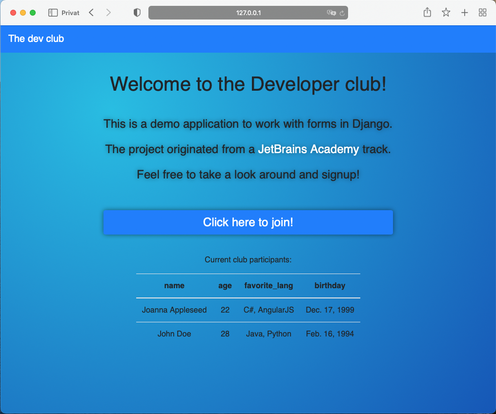

# Django Forms App

A simple web app that allows you to create forms and submit them to the server. In this example,
a developer club web application is being created. The members are shown on the index page.
In a real world application you shouldn't display the names of the participants in the index page due to
privacy reasons.



## Get started

- Clone this repository:

```sh
git clone github.com/dan-koller/Django-Forms-App
```

- Navigate to the directory:

```sh
cd Django-Forms-App
```

- Create
  a [local environment](https://docs.python.org/3/library/venv.html#:~:text=A%20virtual%20environment%20is%20a,part%20of%20your%20operating%20system.):

```sh
virtualenv venv
```

- Install the dependencies:

```sh
pip install -r requirements.txt
```

## Configuration

- Configure a superuser account to administrate the application by running

```sh
venv/bin/python djangoforms/manage.py createsuperuser  
```

- You can customize the app and change the form fields in the [admin interface*](http://localhost:8000/admin).
- The app currently runs in debug mode. Change this in `settings.py` if you want to run in production.

_*) You can read about Django's admin interface [here](https://pypi.org/project/django-admin-interface/)._

## Run the app

- Go to the `src` directory and run the following command:

```sh
venv/bin/python djangoforms/manage.py runserver 8000
```

## Stack

- Python3
- Django
- SQLite3

